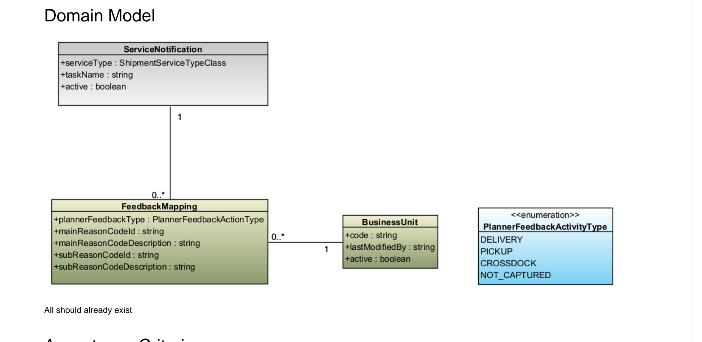

# Feature-010: Feedback Mapping Beheer

## Doel

Als planner wil ik per servicenotificatie en businessunit instellen welke feedbackreden (mainReasonCode + subReasonCode) gekoppeld is aan een activiteitstype zodat retourfeedback gestandaardiseerd en correct verwerkt wordt.

## Domeinmodel

Het onderstaande domeinmodel toont de entiteiten en hun relaties die als basis dienen voor deze feature.
Alle entiteiten bestaan al in het systeem — deze feature voegt beheerfunctionaliteit toe.

## Scope

In scope:

- Beheren van FeedbackMapping-regels: aanmaken, bewerken en deactiveren
- Koppelen van een FeedbackMapping aan een ServiceNotification en een BusinessUnit
- Instellen van plannerFeedbackType (enum: DELIVERY, PICKUP, CROSSDOCK, NOT_CAPTURED)
- Instellen van mainReasonCode + mainReasonCodeDescription en subReasonCode + subReasonCodeDescription
- Filteren en zoeken van FeedbackMappings op servicenotificatie, businessunit en activiteitstype
- Validatie: per combinatie van (ServiceNotification, BusinessUnit, PlannerFeedbackActivityType) mag maximaal één actieve FeedbackMapping bestaan

Out of scope:

- Aanmaken of bewerken van ServiceNotifications zelf
- Aanmaken of bewerken van BusinessUnits
- Automatische verwerking van feedbackberichten (dit is uitsluitend beheerconfiguratie)
- Historische audit van wijzigingen aan FeedbackMappings

## Requirements

- REQ-001: Een beheerder kan een nieuwe FeedbackMapping aanmaken met: serviceNotificationId, businessUnitCode, plannerFeedbackType, mainReasonCode, mainReasonCodeDescription, subReasonCode en subReasonCodeDescription.
- REQ-002: plannerFeedbackType is verplicht en moet één van de volgende waarden zijn: DELIVERY, PICKUP, CROSSDOCK, NOT_CAPTURED.
- REQ-003: mainReasonCode is verplicht en maximaal 50 tekens lang.
- REQ-004: subReasonCode is optioneel en maximaal 50 tekens lang; indien opgegeven moet ook subReasonCodeDescription worden ingevuld.
- REQ-005: Per combinatie van (serviceNotificationId, businessUnitCode, plannerFeedbackType) mag maximaal één actieve FeedbackMapping bestaan; een poging tot duplicaat wordt afgewezen met HTTP 409 Conflict.
- REQ-006: Een beheerder kan een bestaande FeedbackMapping bewerken (alle velden behalve de sleutelcombinatie).
- REQ-007: Een beheerder kan een FeedbackMapping deactiveren (soft delete via active-vlag); gedeactiveerde mappings worden niet gebruikt bij feedbackverwerking.
- REQ-008: De lijst van FeedbackMappings ondersteunt filteren op serviceNotificationId, businessUnitCode en plannerFeedbackType, en paginering (10 per pagina).
- REQ-009: Bij het aanmaken wordt gevalideerd dat de opgegeven ServiceNotification bestaat en actief is.
- REQ-010: Bij het aanmaken wordt gevalideerd dat de opgegeven BusinessUnit bestaat en actief is.

## Business rules

- BR-001: Alleen actieve FeedbackMappings (active = true) worden meegenomen bij feedbackverwerking; gedeactiveerde mappings blijven bewaard voor auditdoeleinden.
- BR-002: Een gedeactiveerde FeedbackMapping kan opnieuw geactiveerd worden; hierbij geldt opnieuw de uniekheidscontrole op de sleutelcombinatie.
- BR-003: mainReasonCodeDescription is verplicht als mainReasonCode is ingevuld en mag maximaal 255 tekens bevatten.
- BR-004: subReasonCodeDescription is verplicht als subReasonCode is ingevuld en mag maximaal 255 tekens bevatten.

## Non-functional

- NFR-001: API response time p95 < 300ms voor het ophalen van de gefilterde FeedbackMapping-lijst.
- NFR-002: Alle schrijfoperaties worden gelogd met correlationId en gebruiker-id.
- NFR-003: Toegang tot alle endpoints is beperkt tot gebruikers met de rol ROLE_ADMIN.

## Data

- Entiteit: FeedbackMapping (bestaand), velden: id: UUID, serviceNotificationId: UUID, businessUnitCode: String, plannerFeedbackType: PlannerFeedbackActivityType, mainReasonCode: String, mainReasonCodeDescription: String, subReasonCode: String (nullable), subReasonCodeDescription: String (nullable), active: Boolean, createdAt: LocalDateTime, updatedAt: LocalDateTime
- Entiteit: ServiceNotification (bestaand, read-only), velden: id: UUID, serviceType: ShipmentServiceTypeClass, taskName: String, active: Boolean
- Entiteit: BusinessUnit (bestaand, read-only), velden: code: String, lastModifiedBy: String, active: Boolean
- Enum: PlannerFeedbackActivityType — DELIVERY, PICKUP, CROSSDOCK, NOT_CAPTURED

## API notes

- Endpoint: GET /api/feedback-mappings — pagineerde lijst; filters: ?serviceNotificationId=, ?businessUnitCode=, ?plannerFeedbackType=, ?active=true
- Endpoint: POST /api/feedback-mappings — nieuwe mapping aanmaken
- Endpoint: GET /api/feedback-mappings/{id} — detail ophalen
- Endpoint: PUT /api/feedback-mappings/{id} — mapping bewerken
- Endpoint: DELETE /api/feedback-mappings/{id} — deactiveren (soft delete, zet active=false)
- Request POST/PUT: { serviceNotificationId, businessUnitCode, plannerFeedbackType, mainReasonCode, mainReasonCodeDescription, subReasonCode?, subReasonCodeDescription? }
- Response: { id, serviceNotification: {id, taskName}, businessUnitCode, plannerFeedbackType, mainReasonCode, mainReasonCodeDescription, subReasonCode, subReasonCodeDescription, active, createdAt, updatedAt }

## Acceptance Criteria

### REQ-001: FeedbackMapping aanmaken

- **AC-001-1**: Gegeven een ingelogde beheerder, wanneer alle verplichte velden correct zijn ingevuld en de combinatie (serviceNotificationId, businessUnitCode, plannerFeedbackType) nog niet bestaat, dan retourneert de API HTTP 201 Created met de aangemaakte mapping inclusief gegenereerd id.
- **AC-001-2**: Gegeven een ingelogde beheerder, wanneer het formulier wordt ingediend zonder mainReasonCode, dan retourneert de API HTTP 400 Bad Request met een veldspecifieke foutmelding.

### REQ-005: Uniciteitscontrole sleutelcombinatie

- **AC-005-1**: Gegeven een actieve FeedbackMapping voor (serviceNotification X, businessUnit Y, DELIVERY), wanneer een beheerder een tweede mapping aanmaakt met dezelfde combinatie, dan retourneert de API HTTP 409 Conflict.
- **AC-005-2**: Gegeven een gedeactiveerde FeedbackMapping voor dezelfde combinatie, wanneer een beheerder een nieuwe actieve mapping aanmaakt voor diezelfde combinatie, dan wordt dit afgewezen met HTTP 409 totdat de bestaande gedeactiveerde mapping definitief verwijderd is.

### REQ-007: Deactiveren

- **AC-007-1**: Gegeven een actieve FeedbackMapping, wanneer een beheerder de mapping deactiveert, dan wordt active=false ingesteld en is de mapping niet meer zichtbaar in de standaardlijst (gefilterd op active=true).
- **AC-007-2**: Gegeven een gedeactiveerde FeedbackMapping, wanneer de lijst wordt opgevraagd met ?active=false, dan is de mapping wel zichtbaar.

## UX notes

- /admin/feedback-mappings: tabel met kolommen ServiceNotificatie, BusinessUnit, Activiteitstype, HoofdredenCode, SubredenCode, Actief; met filterbar bovenaan
- /admin/feedback-mappings/new: aanmaakformulier met dropdowns voor ServiceNotificatie (gefilterd op actief), BusinessUnit (gefilterd op actief) en PlannerFeedbackActivityType; tekstinvoer voor reason codes en descriptions
- /admin/feedback-mappings/{id}/edit: bewerkformulier (zelfde als aanmaak, sleutelcombinatie readonly)
- Componenten: FeedbackMappingTable, FeedbackMappingForm, ServiceNotificationSelect, BusinessUnitSelect, ActivityTypeSelect, ReasonCodeFields
