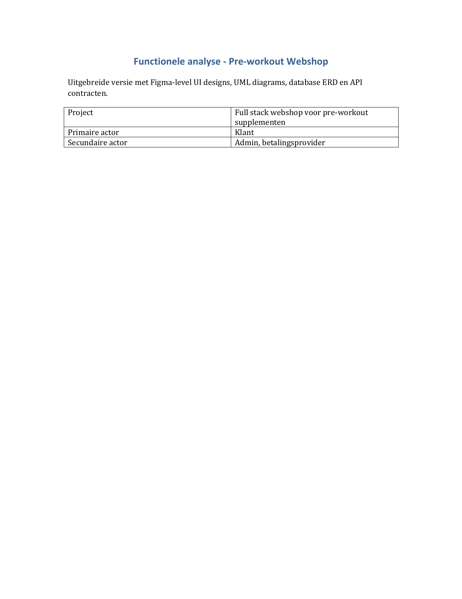
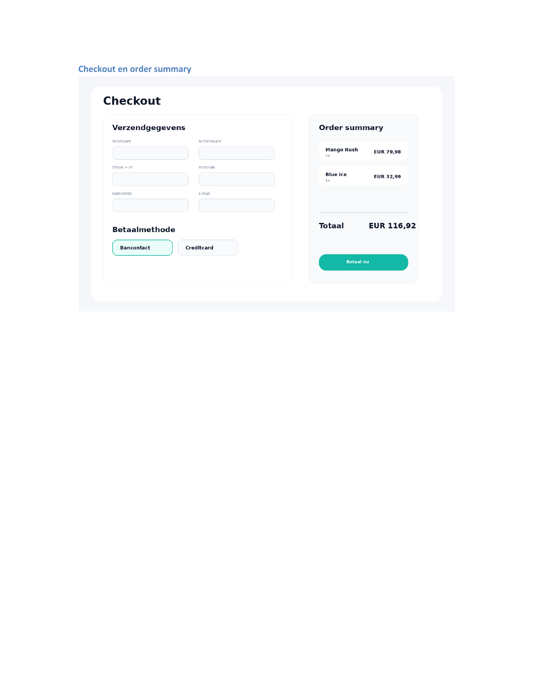

# Feature-feature-011-preworkout-website: Functionele analyse - Pre-workout Webshop

## Functionele analyse - Pre-workout Webshop

## 1. Samenvatting
De applicatie is een traditionele webshop waarin klanten pre-workout producten kunnen zoeken, filteren, bekijken, toevoegen aan hun winkelmand, afrekenen en hun bestelgeschiedenis opvolgen. Admins beheren producten, voorraad en bestellingen.

Belangrijkste modules: productcatalogus, productdetail, workout, checkout, betaling, account, admin dashboard, orderbeheer en API-laag.

## 2. Figma-level UI designs
De onderstaande schermen tonen een realistisch visueel ontwerp voor de belangrijkste klantflows. De stijl gebruikt duidelijke productcards, sterke CTA-knoppen, filterblokken en een checkout met gescheiden invoer en order summary.

### Homepage + shop overzicht

### Productdetailpagina

### Checkout

### Order summary

## 3. Uitgebreide UML diagrams
De UML diagrammen ondersteunen de analyse van gedrag, architectuurcomponenten en deployment.

### Sequence diagram - checkout en betaling
Deze flow toont hoe klant, frontend, API, database en betalingsprovider samenwerken bij afrekenen.

### Component diagram
Dit diagram toont de logische applicatiecomponenten en hun verantwoordelijkheden.

### Deployment diagram
Dit diagram toont een mogelijke cloud deployment met client, CDN, app service, database en payment gateway.

### Database ERD
De database bestaat uit gebruikers, producten, winkelmanditems, bestellingen, orderregels en betalingen. De belangrijkste relaties zijn User 1-N Order, Order 1-N OrderItem, Product 1-N OrderItem, User 1-N CartItem en Order 1-1 Payment.

## API contracten
Onderstaande contracten geven een overzicht voor backend implementatie. Alle endpoints onder /admin vereisen een rol Admin. Klantgebonden endpoints vereisen een geldige JWT access token.

| Endpoint                     | Request