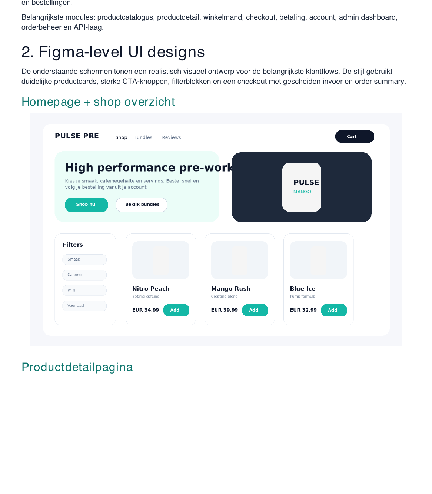
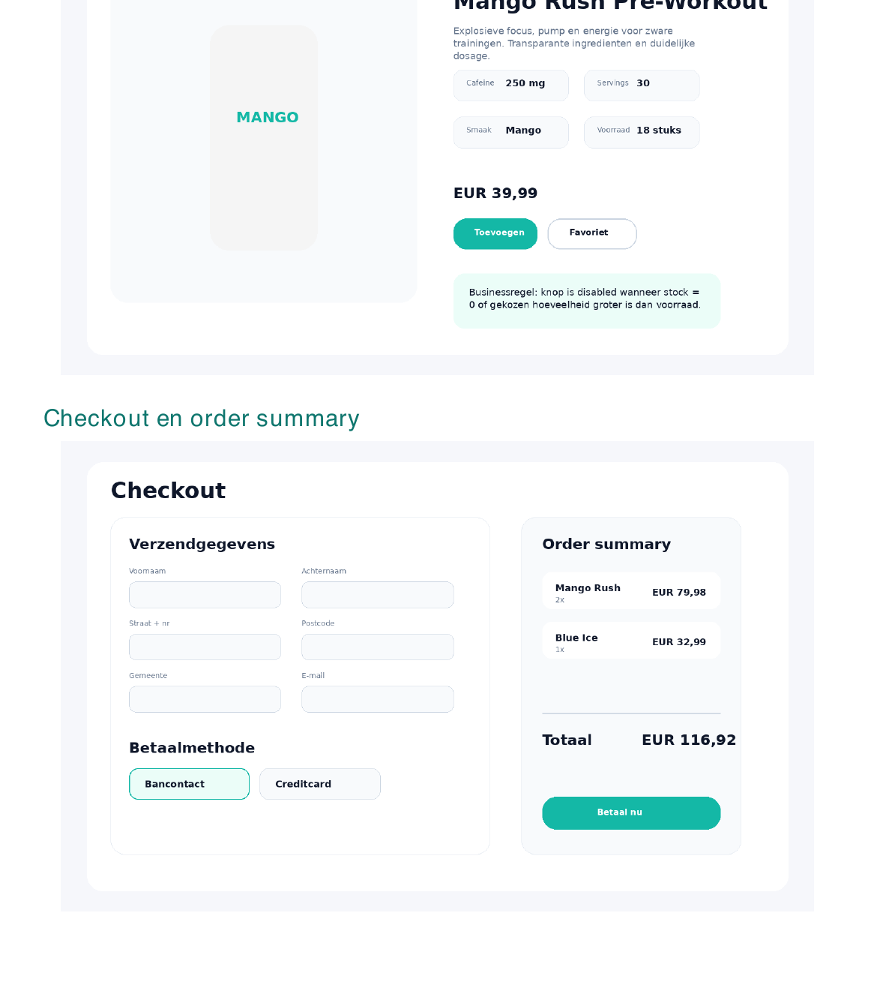
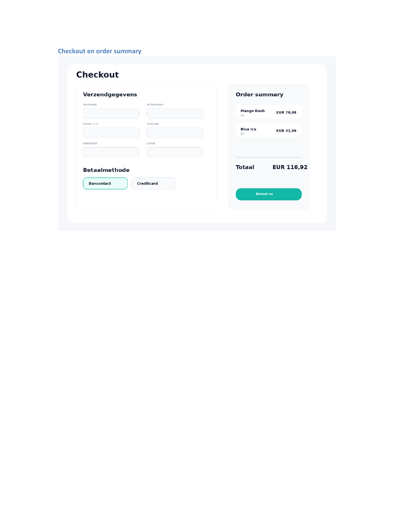
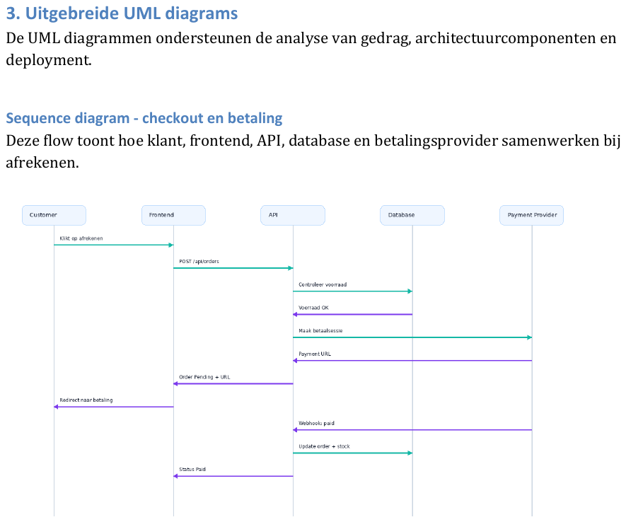
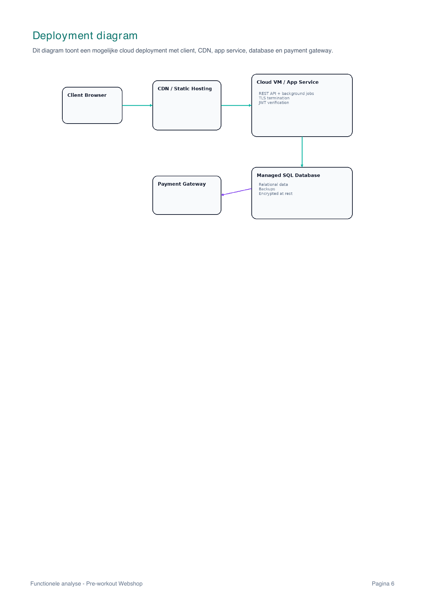
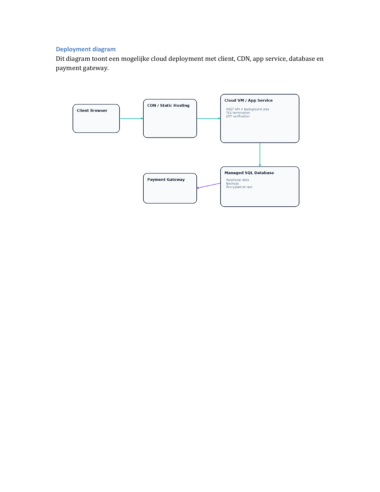
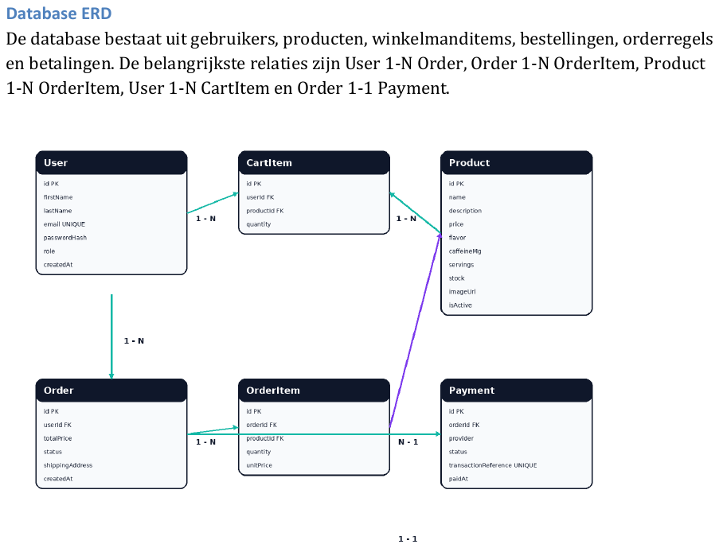

# Feature-feature-011-preworkout-website: Functionele Analyse - Pre-workout Webshop

## Project
### Project
Full stack webshop voor pre-workout supplementen

### Primaire actor
Klant

### Secundaire actor
Admin, betalingsprovider

## Samenvatting
De applicatie is een traditionele webshop waarin klanten pre-workout producten kunnen zoeken, filteren, bekijken, toevoegen aan hun winkelmand, afrekenen en hun bestelgeschiedenis opvolgen. Admins beheren producten, voorraad en bestellingen.

Belangrijkste modules: productcatalogus, productdetail, winkelmand, checkout, betaling, account, admin dashboard, orderbeheer en API-laag.

## Figma-level UI designs

## Homepage + shop overzicht

## Productdetailpagina

## Checkout en order summary

## Uitgebreide UML diagrams

## Sequence diagram - checkout en betaling

## Component diagram

## Deployment diagram

## Database ERD

## API contracten

## Acceptance criteria - kernflows

### REQ-001: Producten bekijken
* AC-001-1: Gegeven actieve producten bestaan, wanneer de klant de shop opent, dan ziet hij producten met naam, prijs, afbeelding en voorraadstatus.
* AC-001-2: Gegeven geen actieve producten bestaan, wanneer de klant de shop opent, dan verschijnt een lege staat met melding.

### REQ-002: Product toevoegen aan winkelmand
* AC-002-1: Gegeven voldoende voorraad, wanneer de klant een hoeveelheid toevoegt, dan verschijnt het product in de winkelmand.
* AC-002-2: Gegeven de hoeveelheid groter is dan voorraad, dan wordt de actie geweigerd met foutmelding.

### REQ-003: Bestelling plaatsen
* AC-003-1: Gegeven een gevuld winkelmandje en geldig adres, wanneer de klant bevestigt, dan wordt een order aangemaakt met status Pending.
* AC-003-2: Gegeven een leeg mandje, wanneer de klant afrekent, dan wordt checkout geblokkeerd.

### REQ-004: Online betaling
* AC-004-1: Gegeven een geldige order, wanneer betaling succesvol is, dan wordt status Paid.
* AC-004-2: Gegeven betaling mislukt, wanneer provider weigert, dan blijft order Pending of wordt Cancelled.

### REQ-005: Admin productbeheer
* AC-005-1: Gegeven adminrechten, wanneer admin product aanmaakt, dan verschijnt het in de catalogus.
* AC-005-2: Gegeven adminrechten, wanneer gebruiker admin endpoint aanroept, dan krijgt hij 403 Forbidden.

## Non-functional requirements

* NFR-001: Responsive op desktop, tablet en mobiel.
* NFR-002: Productoverzicht laadt binnen 2 seconden bij normale belasting.
* NFR-003: Wachtwoorden worden gehasht opgeslagen.
* NFR-004: Betalingsgegevens worden niet lokaal opgeslagen; de betaalprovider verklaart kaar- of bankgegevens.
* NFR-005: API endpoints gebruiken validatie, authenticatie en autorisatie.
* NFR-006: Database bevat constraints voor unieke e-mailadressen, unieke payment references en geldige hoeveelheden.